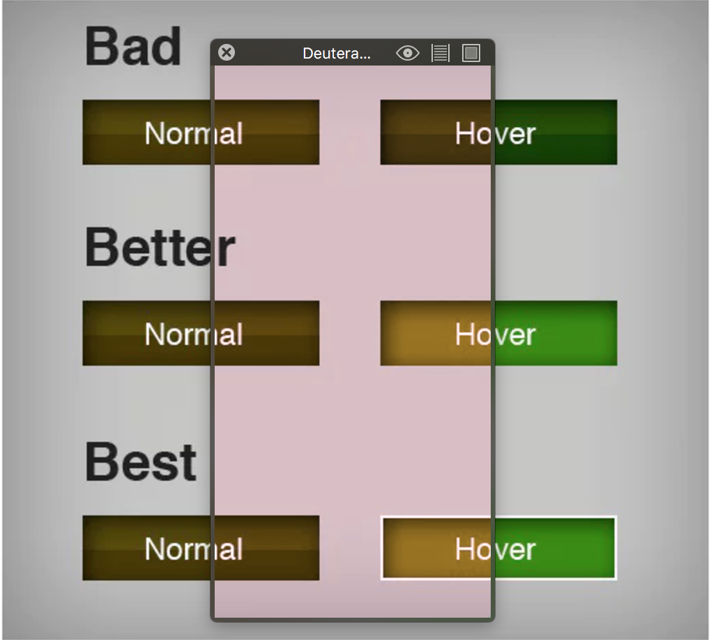
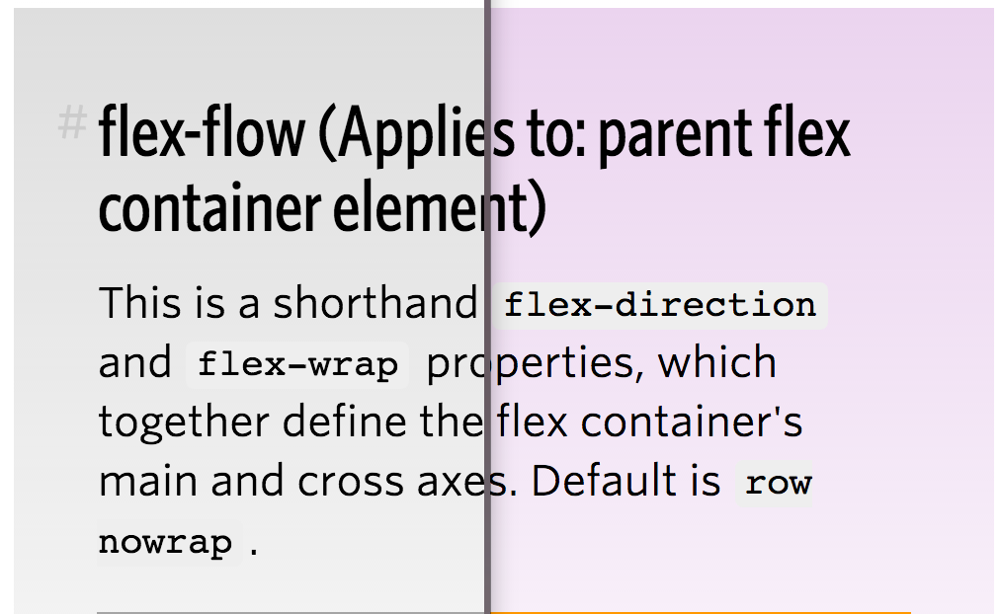
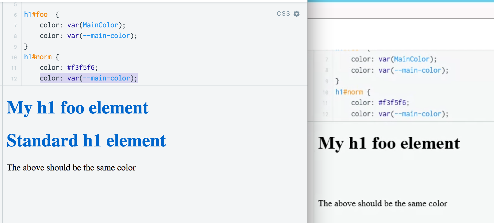
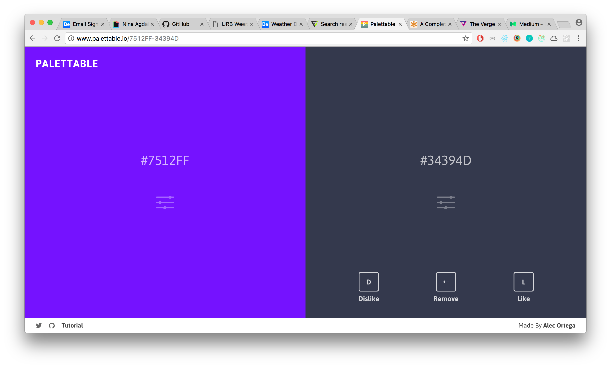
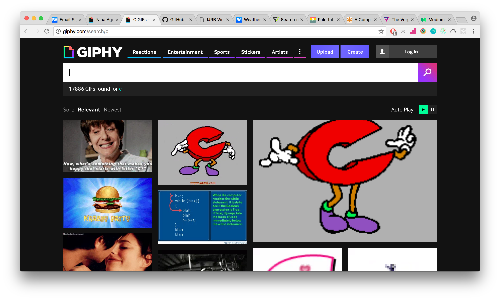

# Browser Technologies

## Browser Features, What happens when u turn them off?
In the folowing paragraph i will be researching what happens when u turn of some browser features.

### Color
In the web there are a couple of ways to use color and a couple of ways this could go wrong.

#### Color uses
* hex
* rgb
* hsl
* css var

#### Ways to go wrong
* Not enough contrast between the background and foreground.
* Not enough visible difference between states.
* Bad color combination.
* Browser not rendering a form of color use.

#### Expectations and Reality
**Expectations**

**Reality**

In reality most of the bigger sites u visit wont have a contrast problem. They use textbook high contrast and have clear difference in states. What in reality is more probable to happen is that the browser doesn't render the color how u expected or that there is no or bad fall-back and it will revert to the default color of the browsers.

#### Web examples
**Low contrast**

**Color not rendering as expected**

*left: Chrome (css vars work) right: IE11 (css vars don't work)*

### No mouse/ No trackpad
Having no mouse or trackpad in browsers is at first an accessibility  problem. Most of the site will still be useable via the TAB key.

#### Expectations and Reality
**Expectations**

Expectations are that big site will have made their sites usable via keyboard.

**Reality**

Most sites are usable but focus states aren't always used so u have no clue where u are in a site.

#### Web examples
**No focus styles**

*Text me button doesn't have focus styles*

**TAB key not going thought whole UI**

*Expected tab would let me go to the settings icon thingy. Reality didn't let me get there*

**Get stuck in search bar**

*Expected tab would let me go thought all the gifs. Reality didn't get farther than the search input*
