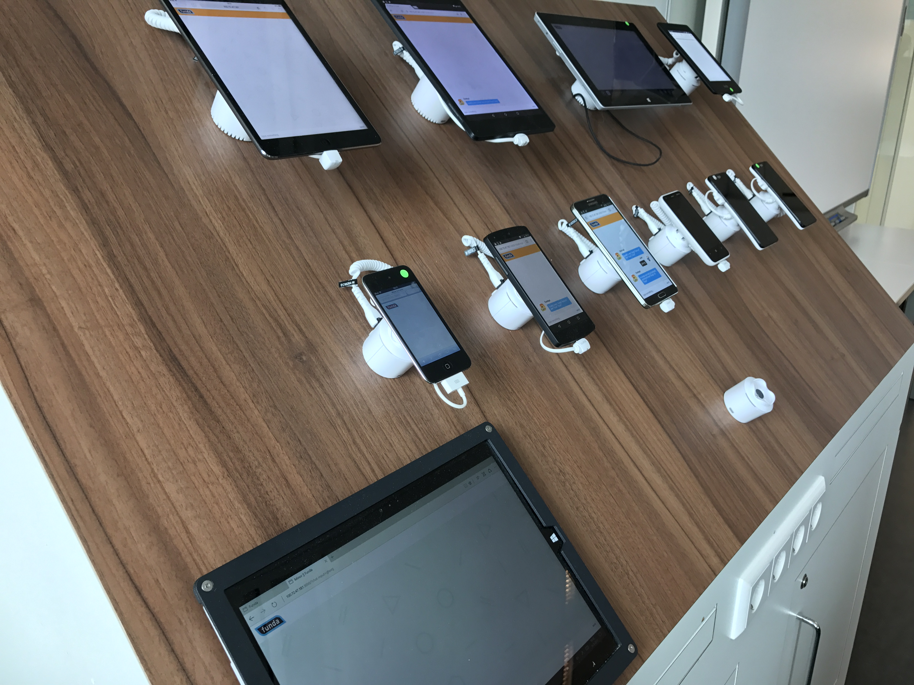
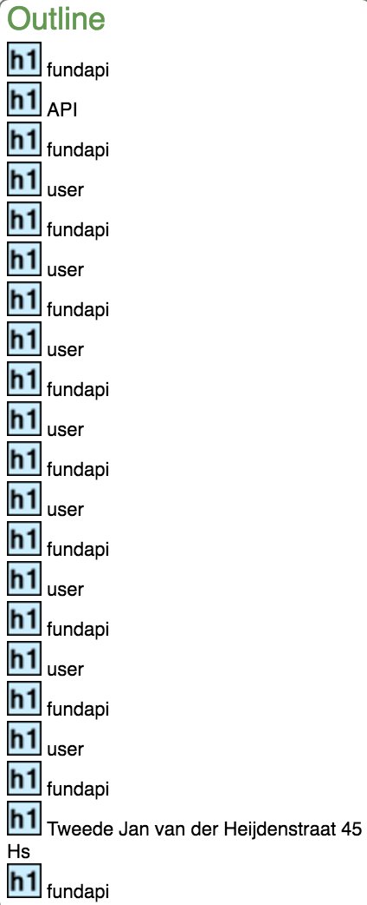

# Funda web app TODO accessibility

## PE issues

### Images
When i turn of the images the app is still accessible. The following screen shot will show what happens.

This could be fixed with a background color fall-back or alt text.

### Custom fonts
When i turn of the custom fonts the app is still accessible. The following screen shot will show what happens.

Could add a different fall-back font in the font-stack.

### Javascript
When i turn of the javascript the app wont do much besides posting the input value to the url. The following screen shot will show what happens.

Could add a start-up div which alerts users with no JS that javascript is a must to run the web app. This div can be clear with JS if it does work.

### Color
When checking the color contrast for accessibility it looks to be compatible with all forms off color blindness in Sim Daltonism. When looking at used way of color codes in css IE wont render colors. The following screen shots will show what happens.

The color css-vars problem can be fixed via a fall-back.

### Internet connection
When throttling your connection the site still loads oke. The following gif will show what happens.

I could async load some stuff to make the app "feel" quicker.

### Cookies
I don't use cookies so when i turn this off nothing changes.

### localStorage
When localStorage doesn't work the app will do a new api call instead of using earlier fetched api response data. The app will still work.

### Mouse/Trackpad
It is possible to TAB through the apps input fields and there is a focus state to see where u are.

## Device Lab

> Testing on a device Lab

After testing on the device lab I have found some little bugs. Following will be a small list of issues.

Issues:
- On iPad on safari there is not a whole lot happening. Seems that javascript is off or something.
- On iPod on safari the same problem persist. With the addition of css vars not working.
- On Samsung tab/ Samsung phone/ Nexus phone all seems to be in working state and fine.
- On windows surface css vars seems to not work. With the addition of nothing happening on screen. (same no js problem probably)
- On kindle the first prone issue is the logo which is all out of proportions. Besides that it doesn't seem to send or receive messages same as the iPad and iPod.

Most off these problems their fixes are already listed above. Most off them are PE issues without a fallback for older devices and browsers.

## Screen Reader
> Using [wave](http://wave.webaim.org/) to test accessibility for screen readers.

> visual problem points the test picks up

> possible problems for screen readers

> outline a screen reader would create

The following would be a problem for screen readers:
- Missing `alt` on images.
> Each image must have an alt attribute. Without alternative text, the content of an image will not be available to screen reader users or when the image is unavailable. ~ wave plugin

- Missing `label` on input field.
> If a form control does not have a properly associated text label, the function or purpose of that form control may not be presented to screen reader users. Form labels also provide visible descriptions and larger clickable targets for form controls. ~ wave plugin

- Outline with only `h1` elements. This won't really enlighten a screen reader if all is `h1`.
> Headings facilitate page navigation for users of assistive technologies. They also provide semantic and visual meaning and structure to the document. First level headings should contain the most important heading(s) on the page (generally the document title). ~ wave plugin

## TL;DR
### TODO
**must**
- [ ] Add fall-back for images to prevent.
- [ ] Add fall-back when there's no JS.
- [ ] Fall-back for css vars.

**could**
- [ ] Add self chosen fall-back font instead of browsers own fall-back.
- [ ] Async some scripts and css to make site feel quicker.
